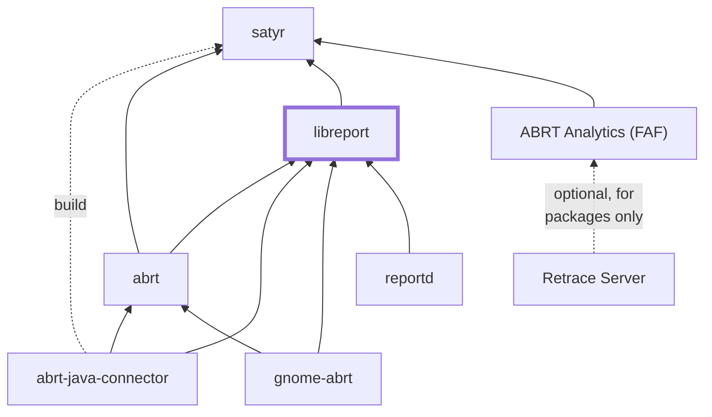

## libreport

Generic library for reporting various problems to destinations like mailing
lists, regular files, remote servers and bug tracking tools.

The library operates on problem data stored in the form of regular files in
a directory (so called dump directory).

The library provides a low level API (dump_dir.h) for creating and modifying
dump directories, a high level API allowing to avoid the need to work with dump
directories (problem_data.h), and a set of tools that file reports.

The library also provides an infrastructure (run_event.h, report_event.conf)
for automatic execution of shell scripts working with dump directories.

The library is used in [**ABRT (Automatic Bug Reporting Tool)**](https://abrt.readthedocs.io).

### Supported report destinations
- **regular files**  : reporter-print
- **e-mail**         : reporter-mailx
- **ftp/scp**        : reporter-upload
- [**Bugzilla**](https://bugzilla.redhat.com)                 : reporter-bugzilla
- [**MantisBT**](https://bugs.centos.org)                     : reporter-mantisbt
- [**FAF**](https://retrace.fedoraproject.org/faf/summary/)   : reporter-ureport

- [**Linux Kernel Oops**](http://www.kerneloops.org/)       : reporter-kerneloops

### Installing
Please see [**INSTALL**](INSTALL) for build and install steps.

### Technologies
* [**satyr**](https://github.com/abrt/satyr) - backtrace processing, micro-reports
* [**ABRT**](https://github.com/abrt/abrt) - main libreport consumer
* [**Python3**](https://www.python.org/) 
* [**GLib2**](https://developer.gnome.org/glib/)
* [**Gtk3**](https://developer.gnome.org/gtk3) 
* [**XML RPC for C and C++**](http://xmlrpc-c.sourceforge.net/) 
* [**json-c**](https://github.com/json-c/json-c) 
